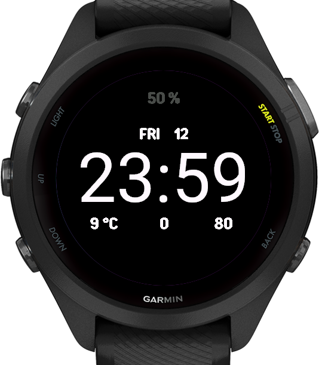

# Out Of The Way

A minimal watchface for the Garmin Forerunner 265S, written in Monkey C.

<p align="center">
  
</p>

Forked from [azyleee/My-Garmin-Watch-Face](https://github.com/azyleee/My-Garmin-Watch-Face), which is MIT-licensed; this fork inherits the same license.

## Layout

- 24-hour time, centered (Garmin system vector font for crisp AMOLED rendering)
- Day-of-week + day-of-month, above the time
- Battery percentage, top
- Weather (°C) / Steps / Heart rate, bottom row
- Dimmed time + date only in always-on / sleep mode

## Build

Prerequisites (macOS, one-time setup):

1. **JDK 21**
   ```sh
   brew install openjdk@21
   ```
2. **Connect IQ SDK Manager** — download from [developer.garmin.com/connect-iq/sdk](https://developer.garmin.com/connect-iq/sdk/), install the DMG.
3. Open the SDK Manager and install:
   - Connect IQ **SDK 9.2.0** (or newer)
   - The **Forerunner 265S** device profile
4. **Developer signing key**:
   ```sh
   mkdir -p ~/.Garmin/ConnectIQ
   openssl genrsa -out ~/.Garmin/ConnectIQ/developer_key.pem 4096
   openssl pkcs8 -topk8 -inform PEM -outform DER \
     -in ~/.Garmin/ConnectIQ/developer_key.pem \
     -out ~/.Garmin/ConnectIQ/developer_key.der -nocrypt
   ```

Compile (from repo root):

```sh
SDK="$(cat "$HOME/Library/Application Support/Garmin/ConnectIQ/current-sdk.cfg")"
export PATH="/opt/homebrew/opt/openjdk@21/bin:$PATH"
mkdir -p bin
"$SDK/bin/monkeyc" -o bin/OOTW.prg -f monkey.jungle \
  -y ~/.Garmin/ConnectIQ/developer_key.der -d fr265s -w
```

Output: `bin/OOTW.prg`.

## Install on the watch

The Forerunner 265S uses MTP, so macOS does not mount it as a disk. Use an MTP browser to copy the file:

1. Install [OpenMTP](https://openmtp.ganeshrvel.com/) (free) — Android File Transfer also works.
2. Connect the watch with a USB-C **data** cable.
3. In OpenMTP, navigate to `Internal Storage / GARMIN / APPS /`.
4. Drag `bin/OOTW.prg` into `APPS/`.
5. Unplug. On the watch: **Settings → Watch Face → Connect IQ → OOTW**.

If Garmin Express is open it will hold the MTP connection — quit it first.

## License

MIT, inherited from the upstream [azyleee/My-Garmin-Watch-Face](https://github.com/azyleee/My-Garmin-Watch-Face).

---

_Disclaimer: the changes in this fork on top of the upstream were generated through agentic coding. Use at your own risk; no warranty is provided or implied._
